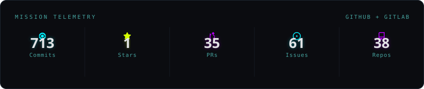

<!-- Galaxy Profile README Template
     Customize this file with your own info, then rename it to README.md
     in your GitHub profile repo (github.com/YOUR_USERNAME/YOUR_USERNAME).
     The SVG paths below point to assets/generated/ which are auto-generated
     by the GitHub Actions workflow or by running: python -m generator.main -->

  

 

  

 

  

 

  

 

<strong>More about me</strong>

 

  

## Hey, I'm Castelli.

Nice to meet you! I'm **Vinicius Castelli**, a Computer Engineering student and IT professional.

I have experience as an entrepreneur, executive, and hands-on developer, delivering software products and generating measurable business results. I've built and led projects across different stages, combining strong technical execution with strategic decision-making. Currently, my focus is on strengthening my engineering fundamentals while continuously evolving as a builder, leader, and problem-solver.

I graduated from the top-ranked high school in my state and the fourth best in Brazil (IDEB, 2024). During that period, I developed several impactful projects (both software-related and interdisciplinary) including one that permanently transformed the school's largest annual event. You can learn more about these projects and my overall trajectory on my [LinkedIn](https://www.linkedin.com/in/vinicius-castelli-812a36240/).

Currently, I'm building a comprehensive comparative genomics library in bioinformatics, and expanding into new domains through a robotics/IMAVs team — where I'm developing my mechanical engineering skills while contributing to the team's financial operations.

 

  
  

